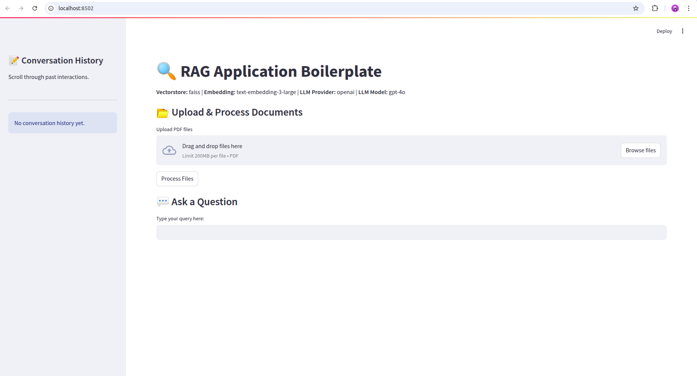

# streamlit-rag-boilerplate

## Description

This is a Retrieval-Augmented Generation (RAG) application built with Streamlit. It supports multiple models and vector stores, allowing users to upload PDF files and interact with the application to retrieve information based on their queries. The application maintains conversation history for a more interactive experience.

## Features

- Multiple model support (OpenAI, Claude, Gemini)
- Integration with various vector stores (FAISS, Chroma, Pinecone)
- Conversation history to track user interactions
- PDF file processing and text extraction

## Installation

To install the required dependencies, run the following command:

```bash
pip install -r requirements.txt
```

## Usage

1. Set up your environment variables in the `.env` file.
2. Run the application using:

```bash
streamlit run app.py
```

3. Upload your PDF files and interact with the application by asking questions about the documents.

## Demo


